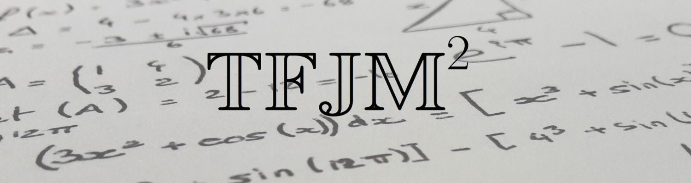
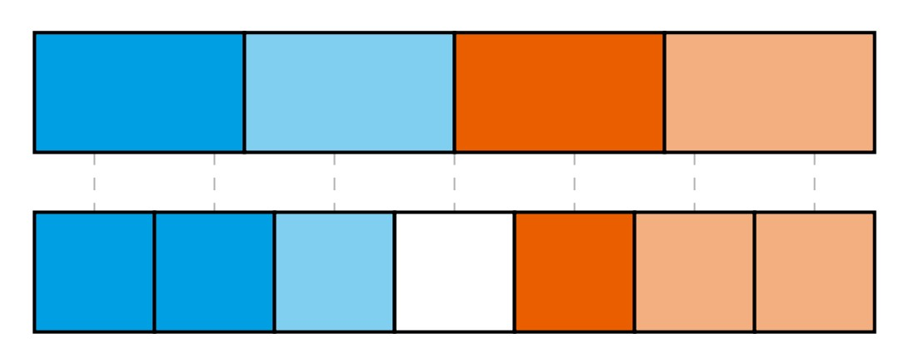
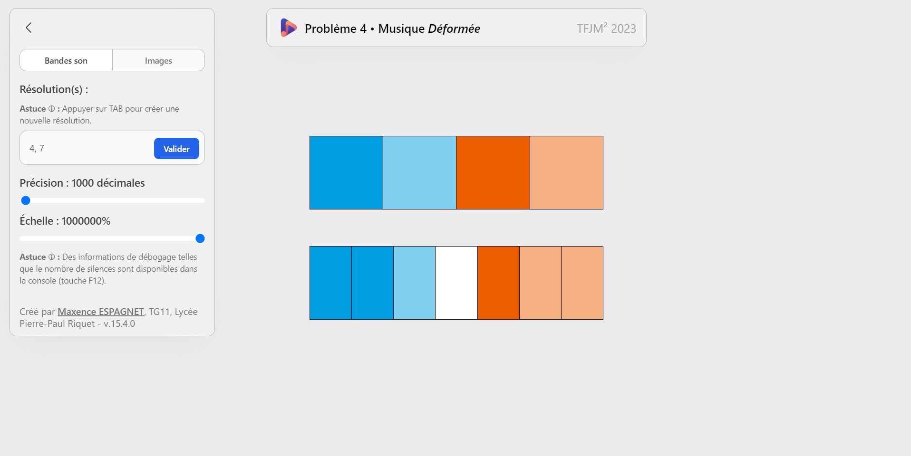
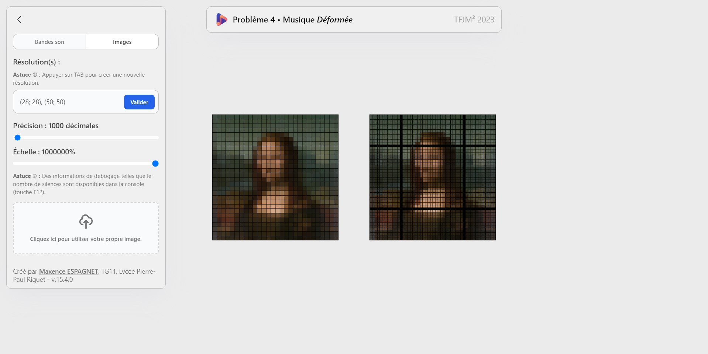

# Problèmes du TFJM² 2023

Vous trouverez ici deux approches différentes pour modéliser un problème mathématique complexe du Tournois Français des Jeunes Mathématiciens et Mathématiciennes :

## Problème 4 :

Énoncé : Perrine joue avec un logiciel de montage audio. Elle dispose initialement d’une bande son d’une minute pendant laquelle sont jouées n ⩾ 1 notes distinctes, chacune de durée 1/n. Le logiciel dispose d’une fonctionnalité permettant d’augmenter ou de diminuer la résolution du son.

Si Perrine choisit une nouvelle résolution m ⩾ 1, le logiciel crée un nouvel audio d’une minute également, constitué de m notes choisies de la manière suivante : pour tout 1 ⩽ k ⩽ m, pour trouver la k-ième note jouée, le logiciel regarde l’intervalle de temps pendant lequel elle doit être jouée dans le nouveau fichier, prend son milieu et choisit la note qui était jouée à cet instant dans l’ancien fichier. Si ce milieu tombe pile entre deux notes dans l’ancien fichier, le logiciel met un silence.

Exemple de changement de résolution (passage de n = 4 à m = 7) :

-   Programme codé en python (approche non conservée) (branche [problem-4](https://github.com/Mw3y/TFJM-2023/tree/problem-4))
-   Programme web (branche [problem-4-web](https://github.com/Mw3y/TFJM-2023/tree/problem-4-web))
    -   Accessible à l'adresse : [https://mw3y.github.io/TFJM-2023/](https://mw3y.github.io/TFJM-2023/)

